_Visit the [main page](../README.md)_

# Performance Studies

* [2018 Benchmark Summary](#2018-benchmark-summary)
* [Comparative Benchmark Study](#comparative-benchmark-study)
* [LTO and PGO studies](#lto-and-pgo-studies)

## 2018 Benchmark Summary

The table below summarizes the results of the 2018 benchmark study. It shows the top-3 tools from each test. Times are in seconds. The tsv-utils tools are in _italics_. (Except for *csv2tsv*, tsv-utils tool names start with "tsv-".)

The benchmarks are described in detail in the [Comparative Benchmark Study](#comparative-benchmark-study) and the [2017](comparative-benchmarks-2017.md) and [2018](comparative-benchmarks-2018.md) comparative benchmark reports. These reports include goals, methodology, test details, caveats, conclusions, etc.

### Top four tools in each benchmark

<table style="width:100% background-color:white border:0">
  <tr>
    <td>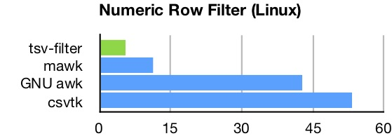</td>
    <td>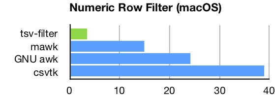</td>
  </tr>
  <tr>
    <td>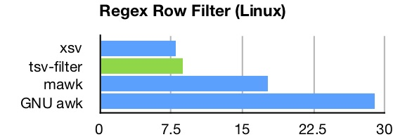</td>
    <td>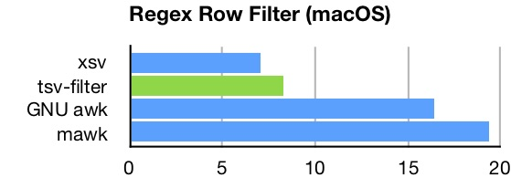</td>
  </tr>
  <tr>
    <td>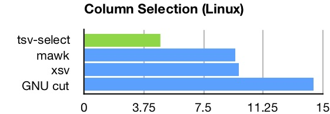</td>
    <td>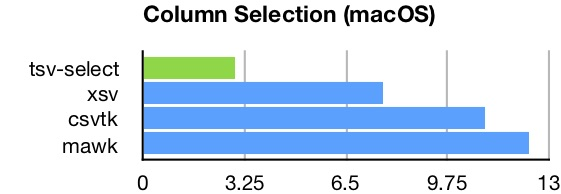</td>
  </tr>
  <tr>
    <td>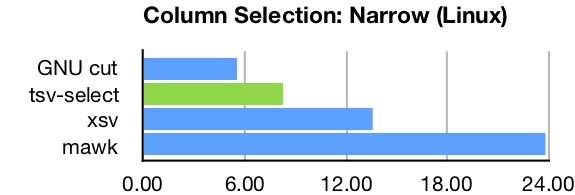</td>
    <td>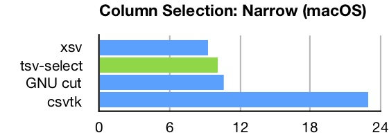</td>
  </tr>
  <tr>
    <td>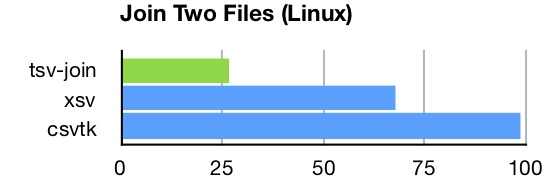</td>
    <td>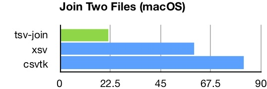</td>
  </tr>
  <tr>
    <td>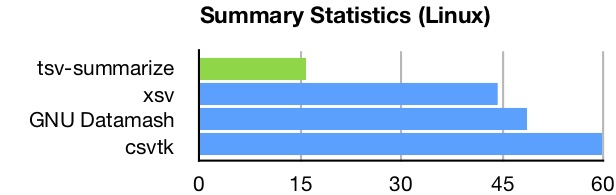</td>
    <td>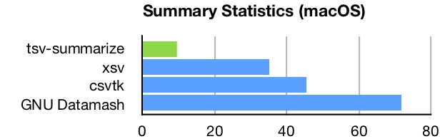</td>
  </tr>
</table>

### Top four tools in each benchmark - Try 2

#### Numeric row filter

This test...

#### Regex row filter

This test...

 

### Top three tools in each benchmark

| Benchmark                     | Platform | 1st             |  Time | 2nd          |  Time | 3rd          |  Time |
|-------------------------------|----------|-----------------|------:|--------------|------:|--------------|------:|
| **Numeric Row Filter**        | Linux    | _tsv-filter_    |  5.48 | mawk         | 11.31 | GNU awk      | 42.80 |
| (4.8 GB, 7M lines)            | Mac OS   | _tsv-filter_    |  3.35 | mawk         | 15.05 | GNU awk      | 24.25 |
| **Regex Row Filter**          | Linux    | xsv             |  7.97 | _tsv-filter_ |  8.80 | mawk         | 17.74 |
| (2.7 GB, 14M lines)           | Mac OS   | xsv             |  7.03 | _tsv-filter_ |  8.28 | GNU awk      | 16.47 |
| **Column selection**          | Linux    | _tsv-select_    |  4.79 | mawk         |  9.51 | xsv          |  9.74 |
| (4.8 GB, 7M lines)            | Mac OS   | _tsv-select_    |  2.93 | xsv          |  7.67 | csvtk        | 11.00 |
| **Column selection (narrow)** | Linux    | GNU cut         |  5.60 | _tsv-select_ |  8.26 | xsv          | 13.60 |
| (1.7 GB, 86M lines)           | Mac OS   | xsv             |  9.22 | _tsv-select_ | 10.18 | GNU cut      | 10.65 |
| **Join two files**            | Linux    | _tsv-join_      | 26.68 | xsv          | 68.02 | csvtk        | 98.51 |
| (4.8 GB, 7M lines)            | Mac OS   | _tsv-join_      | 21.78 | xsv          | 60.03 | csvtk        | 82.43 |
| **Summary statistics**        | Linux    | _tsv-summarize_ | 15.78 | xsv          | 44.38 | GNU Datamash | 48.51 |
| (4.8 GB, 7M lines)            | Mac OS   | _tsv-summarize_ |  9.82 | xsv          | 35.32 | csvtk        | 45.92 |
| **CSV-to-TSV**                | Linux    | _csv2tsv_       | 20.30 | xsv          | 26.82 | csvtk        | 44.82 |
| (2.7 GB, 14M lines)           | Mac OS   | _csv2tsv_       | 10.91 | xsv          | 14.38 | csvtk        | 32.49 |

## Comparative Benchmark Study

Performance is a key motivation for using D rather an interpreted language like Python or Perl. It is also a consideration in choosing between D and C/C++. To gauge D's performance, benchmarks were run comparing eBay's TSV Utilities to a number of similar tools written in other native compiled programming languages. Included were traditional Unix tools as well as several specialized toolkits. Programming languages involved were C, Go, and Rust.

The larger goal was to see how D programs would compare when written in a straightforward style, as if by a team of well qualified programmers in the course of normal development. Attention was giving to choosing good algorithms and identifying poorly performing code constructs, but heroic measures were not used to gain performance. D's standard library was used extensively, without writing custom versions of core algorithms or containers. Unnecessary GC allocation was avoided, but GC was used rather manual memory management. Higher-level I/O primitives were used rather than custom buffer management.

This larger goal was also the motivation for using multiple benchmarks and a variety of tools. Single points of comparison are more likely to be biased (less reliable) due to the differing goals and quality of the specific application.

The study was conducted in March 2017. An update done in April 2018 using the fastest tools from the initial study.

* [March 2017 Comparative Benchmark Study](comparative-benchmarks-2017.md)
* [April 2018 Comparative Benchmark Update](comparative-benchmarks-2018.md)

The D programs performed extremely well, exceeding the author's expectations. Six benchmarks were used in the 2017 study, the D tools were the fastest on each, often by significant margins. This is impressive given that very little low-level programming was done. In the 2018 update the TSV Utilities were first or second on all benchmarks. The TSV Utilities were faster than in 2017, but several of the other tools had gotten faster as well.

As with most benchmarks, there are caveats. The tools used for comparison are not exact equivalents, and in many cases have different design goals and capabilities likely to impact performance. Tasks performed are highly I/O dependent and follow similar computational patterns, so the results may not transfer to other applications.

Despite limitations of the benchmarks, this is certainly a good result. The benchmarks engage a fair range of programming constructs, and the comparison basis includes nine distinct implementations and several long tenured Unix tools. As a practical matter, performance of the tools has changed the author's personal work habits, as calculations that used to take 15-20 seconds are now instantaneous, and calculations that took minutes often finish in 10 seconds or so.

## LTO and PGO studies

In the fall of 2017 eBay's TSV Utilities were used as the basis for studying Link Time Optimization (LTO) and Profile Guided Optimization (PGO). In D, the LLVM versions of these technologies are made available via LDC, the LLVM-based D Compiler.

Both LTO and PGO resulted in significant performance gains. Details are on the [LTO and PGO Evaluation](lto-pgo-study.md) page.

Additional information about LTO and PGO can be found on the [Building with LTO and PGO](BuildingWithLTO.md) page. The slide decks from presentations at [Silicon Valley D Meetup (December 2017)](dlang-meetup-14dec2017.pdf) and [DConf 2018](dconf2018.pdf) also contain useful information, including additional references to other resources about LTO and PGO.
