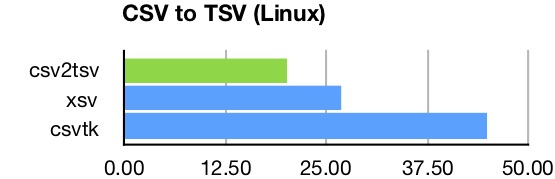
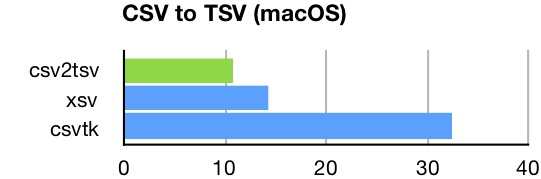

_Visit the [main page](../README.md)_

# Performance Studies

* [Comparative Benchmark Study](#comparative-benchmark-study)
* [2018 Benchmark Summary](#2018-benchmark-summary)
* [LTO and PGO studies](#lto-and-pgo-studies)

Jump to the [2018 Benchmark Summary](#2018-benchmark-summary) for an overview of how tsv-utils performance compares to other tools.

## Comparative Benchmark Study

Performance is a key motivation for using D rather an interpreted language like Python or Perl. It is also a consideration in choosing between D and C/C++. To gauge D's performance, benchmarks were run comparing eBay's TSV Utilities to a number of similar tools written in other native compiled programming languages. Included were traditional Unix tools as well as several specialized toolkits. Programming languages involved were C, Go, and Rust.

The larger goal was to see how D programs would compare when written in a straightforward style, as if by a team of well qualified programmers in the course of normal development. Attention was given to choosing good algorithms and identifying poorly performing code constructs, but no heroic measures were used to gain performance. D's standard library was used extensively, without writing custom versions of core algorithms or containers. Unnecessary GC allocation was avoided, but GC was used rather than manual memory management. Higher-level I/O primitives were used rather than custom buffer management.

This larger goal was also the motivation for using multiple benchmarks and a variety of tools. Single points of comparison are more likely to be biased (less reliable) due to the differing goals and quality of the specific application.

The study was conducted in March 2017. An update done in April 2018 using the fastest tools from the initial study.

* [March 2017 Comparative Benchmark Study](comparative-benchmarks-2017.md)
* [April 2018 Comparative Benchmark Update](comparative-benchmarks-2018.md)

The D programs performed extremely well, exceeding the author's expectations. Six benchmarks were used in the 2017 study, the D tools were the fastest on each, often by significant margins. This is impressive given that very little low-level programming was done. In the 2018 update the TSV Utilities were first or second on all benchmarks. The TSV Utilities were faster than in 2017, but several of the other tools had gotten faster as well.

As with most benchmarks, there are caveats. The tools used for comparison are not exact equivalents, and in many cases have different design goals and capabilities likely to impact performance. Tasks performed are highly I/O dependent and follow similar computational patterns, so the results may not transfer to other applications.

Despite limitations of the benchmarks, this is certainly a good result. The benchmarks engage a fair range of programming constructs, and the comparison basis includes nine distinct implementations and several long tenured Unix tools. As a practical matter, performance of the tools has changed the author's personal work habits, as calculations that used to take 15-20 seconds are now instantaneous, and calculations that took minutes often finish in 10 seconds or so.

## 2018 Benchmark Summary

The graphs below summarize the results of the 2018 benchmark study. Each graph shows the times of the top-4 tools on that test. Times are in seconds. Times for TSV Utilities tools are show with a green bar.

The benchmarks are described in detail in the [Comparative Benchmark Study](#comparative-benchmark-study) section (above) and the [2017](comparative-benchmarks-2017.md) and [2018](comparative-benchmarks-2018.md) comparative benchmark reports. These reports include goals, methodology, test details, caveats, conclusions, etc.

### Numeric row filter

**Test:** Filter rows using numeric tests on individual fields. (*Times in seconds*.) 
**File:** 4.8 GB; 7 million lines.

<table style="width:100%">
  <tr>
    <td></td>
    <td></td>
  </tr>
</table>

### Regular expression row filter

**Test:** Filter rows using regular expressions. (*Times in seconds*.) 
**File:** 2.7 GB; 14 million lines.

<table style="width:100%">
  <tr>
    <td></td>
    <td></td>
  </tr>
</table>

### Column selection

**Test:** Select a subset of columns (aka. "cut"). (*Times in seconds*.) 
**File:** 4.8 GB; 7 million lines

<table style="width:100%">
 <tr>
    <td></td>
    <td></td>
  </tr>
</table>

### Column selection: short lines

**Test:** Select a subset of columns. Run against data with short lines. (*Times in seconds*.) 
**File:** 1.7 GB; 86 million lines

<table style="width:100%">
  <tr>
    <td></td>
    <td></td>
  </tr>
</table>

### Join two files

**Test:** Join two files on a common key. (*Times in seconds*.) 
**File:** 4.8 GB; 7 million lines

<table style="width:100%">
  <tr>
    <td></td>
    <td></td>
  </tr>
</table>

### Summary statistics

**Test:** Calculate summary statistics (count, sum, mean, etc) on individual fields. (*Times in seconds*.) 
**File:** 4.8 GB; 7 million lines

<table style="width:100%">
  <tr>
    <td></td>
    <td></td>
  </tr>
</table>

### Convert CSV to TSV

**Test:** Convert CSV data to TSV. (*Times in seconds*.) 
**File:** 2.7 GB; 14 million lines

<table style="width:100%">
  <tr>
    <td></td>
    <td></td>
  </tr>
</table>

## LTO and PGO studies

In the fall of 2017 eBay's TSV Utilities were used as the basis for studying Link Time Optimization (LTO) and Profile Guided Optimization (PGO). In D, the LLVM versions of these technologies are made available via LDC, the LLVM-based D Compiler.

Both LTO and PGO resulted in significant performance gains. Details are on the [LTO and PGO Evaluation](lto-pgo-study.md) page.

Additional information about LTO and PGO can be found on the [Building with LTO and PGO](BuildingWithLTO.md) page. The slide decks from presentations at [Silicon Valley D Meetup (December 2017)](dlang-meetup-14dec2017.pdf) and [DConf 2018](dconf2018.pdf) also contain useful information, including additional references to other resources about LTO and PGO.
